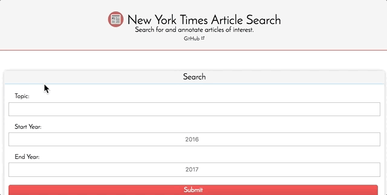
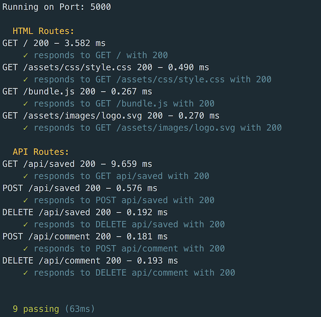

# NYT Article Search

#### Try It Now: [Live Page Link](https://nyt-alek.herokuapp.com/)

 Search for and annotate articles of interest.

 ## Technology Used
 Node.js, Express, React, Mongoose / MongoDB, Axios

### Middleware Stack
Morgan, Helmet

### Testing and Deployment
Travis CI, Mocha, Supertest, Snyk, Gemnasium, Heroku

